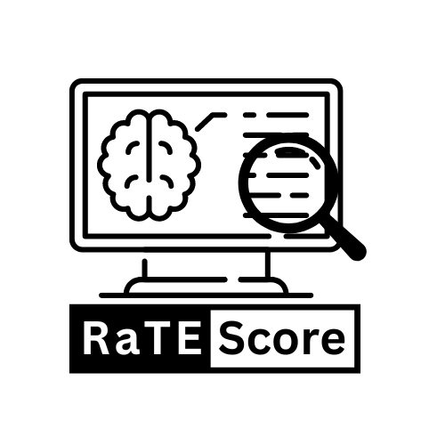
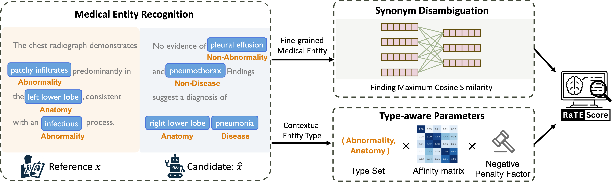

<p style="text-align: left; width: 20%;">
    <a target="_blank">
        
    </a>
</p>


# RaTEScore
RaTEScore: A Metric for Entity-Aware Radiology Text Similarity

<div style='display:flex; gap: 0.25rem; '>
<a href='https://angelakeke.github.io/RaTEScore/'></a>
<a href='https://huggingface.co/Angelakeke/RaTE-NER'></a>
<a href='https://huggingface.co/datasets/Angelakeke/RaTE-NER'></a>
<a href='https://huggingface.co/datasets/Angelakeke/RaTE-Eval'></a> 
<a href=''></a>
</div>

## Overview

RaTEScore is a novel, entity-aware metric to assess the quality of medical reports generated by AI models. It emphasizes crucial medical entities such as diagnostic outcomes and anatomical details, and is robust against complex medical synonyms and sensitive to negation expressions. The evaluations demonstrate that RaTEScore aligns more closely with human preference than existing metrics.


Here is an illustration of the Computation of RaTEScore. 



For more detailed about our pipeline, please refer to our paper.

## Installation

### Environment Preparation
```
pip install RaTEScore
```

## Usage

```python
from RaTEScore import RaTEScore

pred_report = ['There are no intracranial hemorrhages.',
              'The musculature and soft tissues are intact.']

gt_report = ['There is no finding to suggest intracranial hemorrhage.',
            'The muscle compartments are intact.']

ratescore = RaTEScore()
scores = ratescore.compute_score(pred_report, gt_report)
```

## RaTE-NER

 RaTE-NER dataset is a large-scale, radiological named entity recognition (NER) dataset. We set up this dataset to serve our Medical Entity Recognition module of our proposed metric. To download or find out more about our dataset, please refer to [Hugginface](https://huggingface.co/datasets/Angelakeke/RaTE-NER) and our [paper]().

## RaTE-Eval

To effectively measure the alignment between automatic evaluation metrics and radiologists' assessments in medical text generation tasks, we have established a comprehensive benchmark, RaTE-Eval, that encompasses three tasks:

- Sentences-level Human Rating.
- Paragraph-level Human Rating.
- Rating on the Synthetic Reports.

To download or find out more about our dataset, please refer to [Hugginface](https://huggingface.co/datasets/Angelakeke/RaTE-Eval) and our [paper]().

## Default Scheme

For **Medical Entity Recognition module**, we default to use our fine-tuned version of DeBERTa on the RaTE-NER dataset. It is based on whole the IOB scheme. 

For **Synonym Disambiguation Encoding module**, we default to ultilize [BioLORD-2023-C](https://huggingface.co/FremyCompany/BioLORD-2023-C). We have discussed this part in our paper. You can also change this to other pretrained bert models.

## Contact
If you have any questions, please feel free to contact zwk0629@sjtu.edu.cn.

## Citation
```

```
